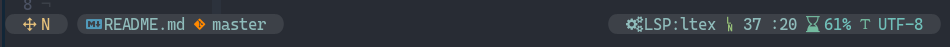
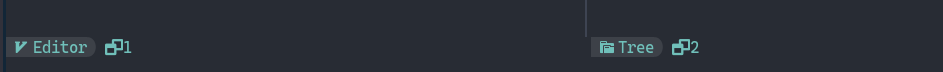

# Fork of [nerd-galaxyline](https://github.com/Avimitin/nerd-galaxyline)

**Unmodified :**


nerd-galaxyline is a modern and great-looking status bar theme for
[galaxyline](https://github.com/glepnir/galaxyline.nvim). Forked from
[evilline](https://github.com/LoydAndrew/nvim/blob/main/evilline.lua)
and have numerous changes been made in the appearance.

## Features

- ❌ Removed : <s>Support `coc.nvim` diagnostic information report.</s>
- ❌ Removed : <s>FileFormat</s>
- ✅ Replaced by : The name of the current LSP. (Is it possible to cycle through multiple LSP ?)
- ❌ Removed `check_git_workspace` Replaced by ✅ `get_git_dir` : [glepnir/galaxyline.nvim](https://github.com/glepnir/galaxyline.nvim/blob/main/lua/galaxyline/provider_vcs.lua)
- Full nerdfont icons.
- Support automatic truncation of status text
- **Added support for [onedark](https://github.com/joshdick/onedark.vim)** ( [First tint of #282C34](https://www.color-hex.com/color/282c34) )

**New :**


- Now support different color scheme and will change background color automatically.

  Currently supported theme:

```text
    * ever forest
    * deus
    * gruvbox
    * onedark
```

- Short line support
- **Added support for [CHADTree](https://github.com/joshdick/onedark.vim)** (+ minor colors changes
  )



## Requirement

Requires neovim 0.5.0+ and a patched
[nerd font](https://www.nerdfonts.com/).

## Install

Using [vim-plug]()

```
Plug 'glepnir/galaxyline.nvim'
Plug 'H97-Git/nerd-galaxyline-onedark'
```

## License

MIT LICENSE
